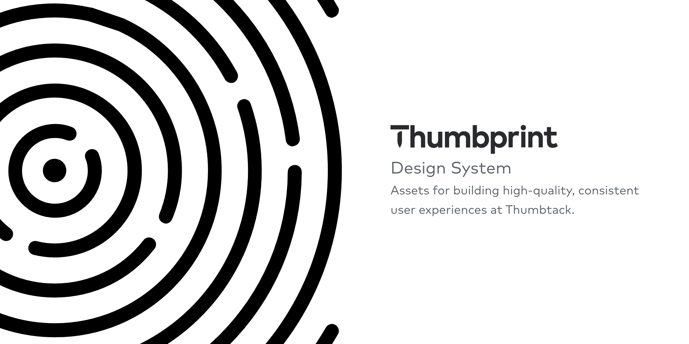

# Thumbprint

Thumbprint is the design system at Thumbtack. Though its primary purpose to support Thumbtack projects, we have open-sourced it for those interested in how we build and manage our documentation and code.

## Documentation

Thumbprint is documented at [thumbprint.design](https://thumbprint.design/).

## Playground

The Thumbprint repo includes a Target named `Playground` and it's a sandbox app where those interested can test out the different Thumbprint components. It can be a great place to get a sense for the components before using them.

 

## Contributing

Thumbprint accepts issues and pull requests. Take at look at our [contribution guidelines](https://thumbprint.design/overview/contributing/) if you'd like to contribute. We also maintain a [CONTRIBUTING.md](CONTRIBUTING.md) file that contains developer-specific instructions.

## License

Thumbprint is licensed under the terms of the [Apache License 2.0](LICENSE).

## Assets

Cat photo in `/Thumbprint/Targets/Playground/Assets/Assets.xcassets` from [Unsplash](https://unsplash.com), photographed by Manja Vitolic ([LICENSE](https://unsplash.com/license)).

Assets `/Thumbprint/Targets/ThumbprintPublicResources/Assets.xcassets` from [FeatherIcons](https://feathericons.com/) ([LICENSE](https://github.com/feathericons/feather/blob/master/LICENSE)).
